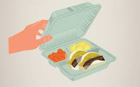

  
Full Cycle Takeout, a non-profit organization dedicated to sustainability, faced a substantial challenge with 20-30% container loss at events. In response, we developed a mobile app for that tracked the rentals and returns of the containers for their reusable container program. The user-friendly interface automated the rental process, encouraging consistent returns. The app resembled bike/scooter rental services, enabling registered users to seamlessly check out containers. 

## My Contributions
In the Full Cycle Takeout project, I focused on the front end, working on the user interface (UI) of the mobile app. My main goal was to make the app easy to use and visually appealing. I wanted to ensure that users could effortlessly check out and return reusable containers. My work on the front end aimed to make the app both good-looking and practical, contributing to the overall success of Full Cycle Takeout's sustainability initiative.

## What I learned 
Throughout my involvement in the project, I gained valuable insights into issue-driven project management, which proved to be a transformative learning experience. Effectively navigating and addressing challenges became an integral part of my contribution. Additionally, I deepened my understanding of React, honing my skills in this powerful JavaScript library. Working on the front end of the Full Cycle Takeout mobile app allowed me to practically apply React principles, from crafting dynamic user interfaces to seamlessly integrating features. This hands-on experience not only enhanced my technical proficiency but also provided a real-world context for applying issue-driven project management methodologies. Overall, the project served as a dynamic learning ground, allowing me to grow both as a developer and as a contributor to sustainable initiatives.

You can learn more at our [Github page.](https://ethical-haccers.github.io)
